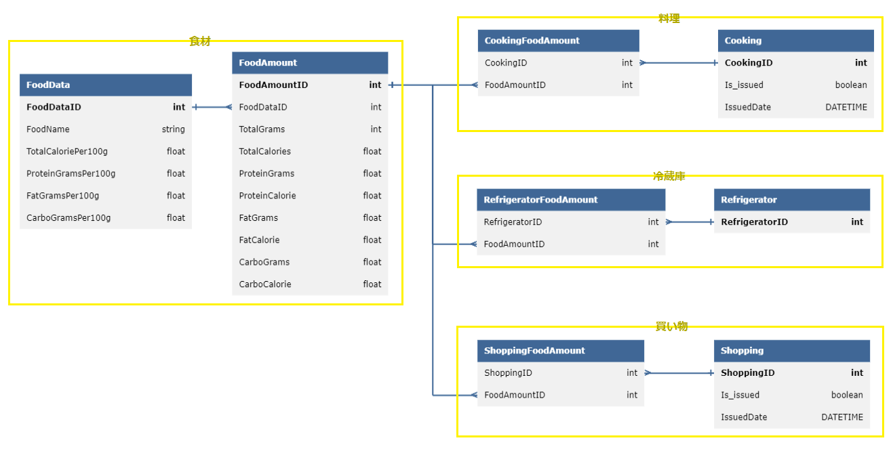
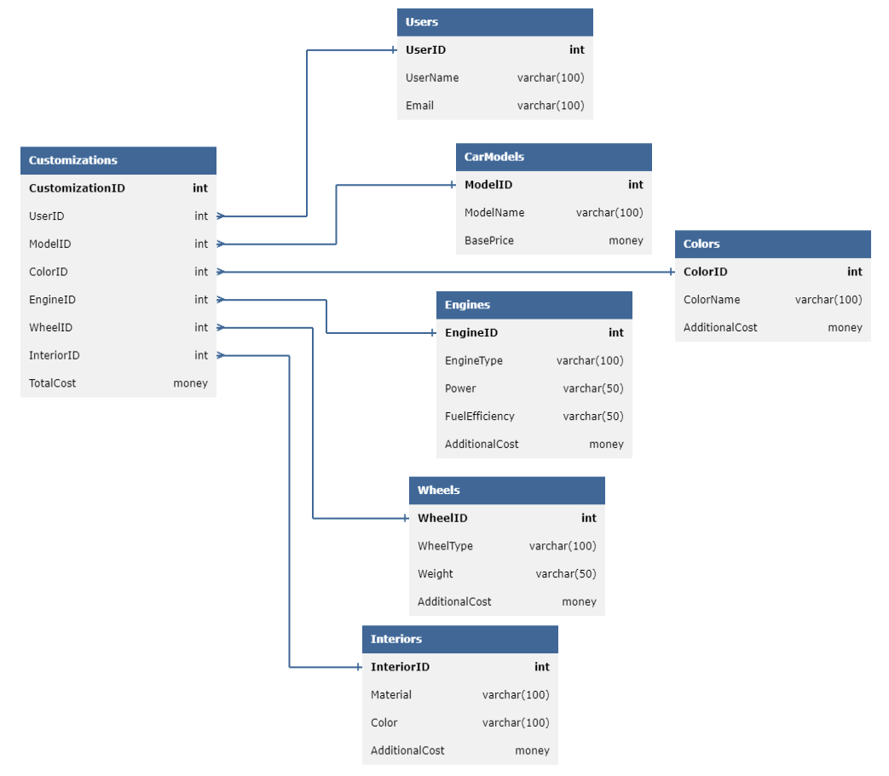

# ＜「今回実施するテーマ」のSQLiteデータベース＞

## ER図



<details>
<summary>ERDLでの表記</summary>

https://databasediagram.com/app

```sql
/*************【食材】*************/
FoodData
-
FoodDataID int PK
FoodName string
TotalCaloriePer100g float
ProteinGramsPer100g float
FatGramsPer100g float
CarboGramsPer100g float

FoodAmount
-
FoodAmountID int PK
FoodDataID int FK > FoodData.FoodDataID 
TotalGrams int
TotalCalories float
ProteinGrams float
ProteinCalorie float
FatGrams float
FatCalorie float
CarboGrams float
CarboCalorie float

/*************【料理】*************/
Cooking
-
CookingID int PK
Is_issued boolean
IssuedDate DATETIME

CookingFoodAmount
-
CookingID int FK > Cooking.CookingID
FoodAmountID int FK > FoodAmount.FoodAmountID 

/*************【冷蔵庫】*************/
Refrigerator
-
RefrigeratorID int PK

RefrigeratorFoodAmount
-
RefrigeratorID int FK > Refrigerator.RefrigeratorID 
FoodAmountID int FK > FoodAmount.FoodAmountID 

/*************【買い物】*************/
Shopping
-
ShoppingID int PK
Is_issued boolean
IssuedDate DATETIME

ShoppingFoodAmount
-
ShoppingID int FK > Shopping.ShoppingID 
FoodAmountID int FK > FoodAmount.FoodAmountID 
```

</details>


# ＜参考：「MS1上の元々のテーマ1」のSQLiteデータベース＞

## ER図



<details>
<summary>ERDLでの表記</summary>

https://databasediagram.com/app

```sql
CarModels
-
ModelID int PK
ModelName varchar(100)
BasePrice money NOT NULL

Colors
-
ColorID int PK
ColorName varchar(100)
AdditionalCost money NOT NULL

Engines
-
EngineID int PK
EngineType varchar(100)
Power varchar(50)
FuelEfficiency varchar(50)
AdditionalCost money NOT NULL

Wheels
-
WheelID int PK
WheelType varchar(100)
Weight varchar(50)
AdditionalCost money NOT NULL

Interiors
-
InteriorID int PK
Material varchar(100)
Color varchar(100)
AdditionalCost money NOT NULL

Customizations
-
CustomizationID int PK
UserID int FK > Users.UserID
ModelID int FK > CarModels.ModelID
ColorID int FK > Colors.ColorID
EngineID int FK > Engines.EngineID
WheelID int FK > Wheels.WheelID
InteriorID int FK > Interiors.InteriorID
TotalCost money NOT NULL

Users
-
UserID int PK
UserName varchar(100)
Email varchar(100)
```

</details>