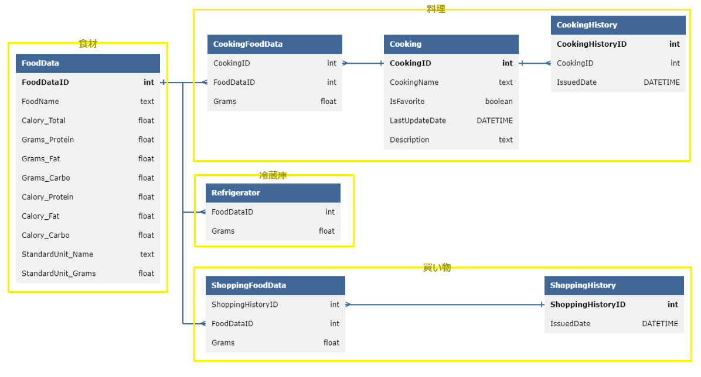

# 「今回実施するテーマ」のSQLiteデータベース

## 【ER図】

<details>
<summary>ERDLでの表記</summary>

https://databasediagram.com/app

```sql/*************【食材】*************/
FoodData
-
FoodDataID int PK
FoodName string
Calory_Total_Per100g float
Grams_Protein_Per100g float
Grams_Fat_Per100g float
Grams_Carbo_Per100g float

FoodAmount
-
FoodAmountID int PK
FoodDataID int FK > FoodData.FoodDataID 
Grams_Total float
Grams_Protein float
Grams_Fat float
Grams_Carbo float
Calory_Total float
Calory_Protein float
Calory_Fat float
Calory_Carbo float

/*************【料理】*************/
CookingHistory
-
CookingHistoryID int PK
CookingID int FK > Cooking.CookingID
IssuedDate DATETIME

Cooking
-
CookingID int PK
CookingName string
IsFavorite bool
LastUpdateDate DATETIME
Description string

CookingFoodAmount
-
CookingID int FK > Cooking.CookingID
FoodAmountID int FK > FoodAmount.FoodAmountID 

/*************【冷蔵庫】*************/
Refrigerator
-
FoodAmountID int FK > FoodAmount.FoodAmountID 

/*************【買い物】*************/
ShoppingHistory
-
ShoppingHistoryID int PK
IssuedDate DATETIME

ShoppingFoodAmount
-
ShoppingID int FK > ShoppingHistory.ShoppingHistoryID 
FoodAmountID int FK > FoodAmount.FoodAmountID 
```

</details>



## 【各テーブルの設計詳細】

#### **`FoodData`**
- ＜テーブルの概要＞
    - 食材情報を管理するテーブル．
    - 何らかの外部データをjsonで保存しておいたものを読み込んで生成するイメージ．
        - 理想的には外部サイトをスクレイピングしたものをjsonに出来ると良い．
        - 直接スクレイピングした結果をDBに書き込むよりも，一回jsonを経由した方がtestがしやすくて良い．
<br>

- ＜各要素の定義＞
    - `FoodDataID`：食材データの一意の識別子
    - `FoodName`：食材の名前． **日本語で書かれることが望ましい．**
    - `Calory_Total_Per100g`：100gあたりの総カロリー．単位は[kcal]．
    - `Grams_Protein_Per100g`：100gあたりのタンパク質量．単位は[g]．
    - `Grams_Fat_Per100g`：100gあたりの脂肪量．
    - `Grams_Carbo_Per100g`：100gあたりの炭水化物量．単位は[g]．

#### **`FoodAmount`**
- ＜テーブルの概要＞
    - 食材の量とその栄養価を管理するテーブル．
    - `Calory_Protein` `Calory_Fat` `Calory_Carbo`の値は `Grams_Protein` `Grams_Fat` `Grams_Carbo` から自動的に求まるが，GramからCaloryへの変換はなるべく1か所だけで行いたい．そのため，一見冗長に見えるかもしれないがFoodAmountの時点でCaloryをデータとして持っておく．
        - 一般的に「タンパク質1g = 4kcal」「脂質1g = 9kcal」「炭水化物1g = 4kcal」であるが，細かい小数点まで考えると複数の変換の定義が産まれてもおかしくない．
        - 変換の定義を1か所だけにする方法として変換用の共通関数をおく手段もあるが，複数の変換用共通関数が定義される恐れがある，変換用共通関数を使わない実装が産まれる可能性がある，等の抜け道があることから，今回はDBに変換後の値を直接埋め込むこととする．（一方でDB容量の無駄であるので，本来ならば共通関数をきっちり管理するのが理想的だとは思われるが，今回は頑健性を重視する．）
<br>

- ＜各要素の定義＞
    - `FoodAmountID`：食材量データの一意の識別子
    - `FoodDataID`：対応する食材データの識別子（外部キー）
    - `Grams_Total`：総量．単位は[g]．
    - `Grams_Protein`：タンパク質量．単位は[g]．
    - `Grams_Fat`：脂肪量．単位は[g]．
    - `Grams_Carbo`：炭水化物量．単位は[g]．
    - `Calory_Total`：総カロリー．単位は[kcal]．
    - `Calory_Protein`：タンパク質由来のカロリー．単位は[kcal]． **「1g = 4kcal」として計算する．**
    - `Calory_Fat`：脂肪由来のカロリー．単位は[kcal]． **「1g = 9kcal」として計算する．**
    - `Calory_Carbo`：炭水化物由来のカロリー．単位は[kcal]． **「1g = 4kcal」として計算する．**

#### **`CookingHistory`**
- ＜テーブルの概要＞
    - 料理履歴を管理するテーブル
    - このテーブルは，例えばStreamlitのUI上で「直近作った料理」を表示するような用途を想定して用意している．
<br>

- ＜各要素の定義＞
    - `CookingHistoryID`：料理履歴の一意の識別子
    - `CookingID`：対応する料理の識別子（外部キー）
    - `IssuedDate`：料理を作成した日付．「いつ作った料理か」が分かるようにするための要素．

#### **`Cooking`**
- ＜テーブルの概要＞
    - 料理情報を管理するテーブル．
        - 実際に何の食材をどれだけの量使っているかは`CookingFoodAmount`のテーブルを用いて特定する．
    - このテーブルは，実際に料理を作ったかどうか関わらず料理情報データを加える可能性があることを想定している．
        - 例えばいくつかの料理を登録しておいて，次に作る料理を料理一覧から呼び出せるような使い勝手に対応できることを意図している．
        - また，実際に料理を作らずとも料理データだけ編集する可能性を考慮し， `LastUpdateDate`という要素を用意している．
<br>

- ＜各要素の定義＞
    - `CookingID`：料理データの一意の識別子
    - `CookingName`：料理の名前． **日本語で書かれることが望ましい．**
    - `IsFavorite`：お気に入りかどうかのフラグ．Trueが「お気に入りである」ことを示す．
    - `LastUpdateDate`：最終更新日
    - `Description`：料理の説明

#### **`CookingFoodAmount`**
- ＜テーブルの概要＞
    - 料理に含まれる食材の量を管理するテーブル
    - 本テーブルはPrimaryKeyを持たない．`Cooking`テーブルに対して複数の`FoodAmountID`テーブルを紐づけるような「1対多の関係」を成立させるために用意したテーブルである．
<br>

- ＜各要素の定義＞
    - `CookingID`：対応する料理の識別子（外部キー）
    - `FoodAmountID`：対応する食材量の識別子（外部キー）

#### **`Refrigerator`**
- ＜テーブルの概要＞
    - 冷蔵庫内の食材の量を管理するテーブル
    - 冷蔵庫は1つだけであるという仮定を置く．そのため，PrimaryKeyとして `RefrigeratorID` のようなデータを意図的に持たせていない．
        - 仮に冷蔵庫が2つ以上あることを許容すると，例えば「Aという冷蔵庫に豚肉が100g」「Bという冷蔵庫に豚肉が150g」あるとして，料理に豚肉を200g使った場合，「AとBそれぞれから何gの豚肉を使うのか」が一意に定まらない．このポリシーを定めるのは設計上煩雑であるため，まずは単純化して冷蔵庫は1つであると見なす．
<br>

- ＜各要素の定義＞
    - `FoodAmountID`：対応する食材量の識別子（外部キー）

#### **`ShoppingHistory`**
- ＜テーブルの概要＞
    - 買い物履歴を管理するテーブル
    - `CookingHistory`と同じような役割であるが，`Cooking`に相当するようなテーブルは買い物情報系には作成していない．
        - これは，料理においては全く同じ料理を複数回作る可能性があるものの，買い物においては全く同じ買い物内容を複数回行う可能性は高くないと思われるため，1回ごとの買い物に名前を付ける必要性が薄いと判断されるためである．
<br>

- ＜各要素の定義＞
    - `ShoppingHistoryID`：買い物履歴の一意の識別子
    - `IssuedDate`：買い物を行った日付

#### **`ShoppingFoodAmount`**
- ＜テーブルの概要＞
    - 買い物で購入した食材の量を管理するテーブル
    - `CookingFoodAmount`と同様に「1対多の関係」を成立させるために用意したテーブルであり，PrimaryKeyを持たない．
<br>

- ＜各要素の定義＞
    - `ShoppingID`：対応する買い物履歴の識別子（外部キー）
    - `FoodAmountID`：対応する食材量の識別子（外部キー）


---

# 参考：「MS1上の元々のテーマ1」のSQLiteデータベース

## 【ER図】

<details>
<summary>ERDLでの表記</summary>

https://databasediagram.com/app

```sql
CarModels
-
ModelID int PK
ModelName varchar(100)
BasePrice money NOT NULL

Colors
-
ColorID int PK
ColorName varchar(100)
AdditionalCost money NOT NULL

Engines
-
EngineID int PK
EngineType varchar(100)
Power varchar(50)
FuelEfficiency varchar(50)
AdditionalCost money NOT NULL

Wheels
-
WheelID int PK
WheelType varchar(100)
Weight varchar(50)
AdditionalCost money NOT NULL

Interiors
-
InteriorID int PK
Material varchar(100)
Color varchar(100)
AdditionalCost money NOT NULL

Customizations
-
CustomizationID int PK
UserID int FK > Users.UserID
ModelID int FK > CarModels.ModelID
ColorID int FK > Colors.ColorID
EngineID int FK > Engines.EngineID
WheelID int FK > Wheels.WheelID
InteriorID int FK > Interiors.InteriorID
TotalCost money NOT NULL

Users
-
UserID int PK
UserName varchar(100)
Email varchar(100)
```

</details>

